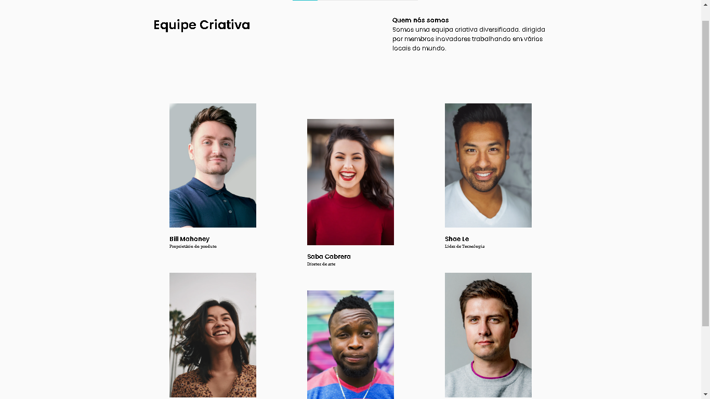

<h1 align="center">Page MyTeam Master</h1>

   Solution for a challenge from  <a href="http://devchallenges.io" target="_blank">Devchallenges.io</a>.

  <h3>
    <a href="https://brunoguerra-myteam-page.netlify.app/">
      Demo
    </a>
     | 
    <a href="https://devchallenges.io/solutions/J1VthPYxnY7ipx4bWk2b">
      Solution
    </a>
     | 
    <a href="https://devchallenges.io/challenges/hhmesazsqgKXrTkYkt0U">
      Challenge
    </a>
  </h3>

<!-- TABLE OF CONTENTS -->

## Table of Contents

- [Overview](#overview)
  - [Built With](#built-with)
- [Features](#features)
- [Contact](#contact)

<!-- OVERVIEW -->

## Overview

<!-- Introduce your projects by taking a screenshot or a gif. Try to tell visitors a story about your project by answering:

- Where can I see your demo?
- What was your experience?
- What have you learned/improved?
- Your wisdom? :) -->

### Built With

<!-- This section should list any major frameworks that you built your project using. Here are a few examples.-->

- [HTML](https://www.w3.org/html/)
- [CSS](https://www.w3.org/Style/CSS/Overview.en.html)

## Features

<!-- List the features of your application or follow the template. Don't share the figma file here :) -->

This page was created for learning, by the challenge of the [DevChallenges] (https://devchallenges.io/challenges). The [challenge] (https://devchallenges.io/challenges/wBunSb7FPrIepJZAg0sY) was to build a page in case you don't find it

## Contact

- Website [brunoguerra.netlify.app](https://brunoguerra.netlify.app/)
- GitHub [@brunorguerra](https://www.github.com/brunorguerra)
- Instagram [@bruno.bernardees](https://www.instagram.com/bruno.bernardees/)
